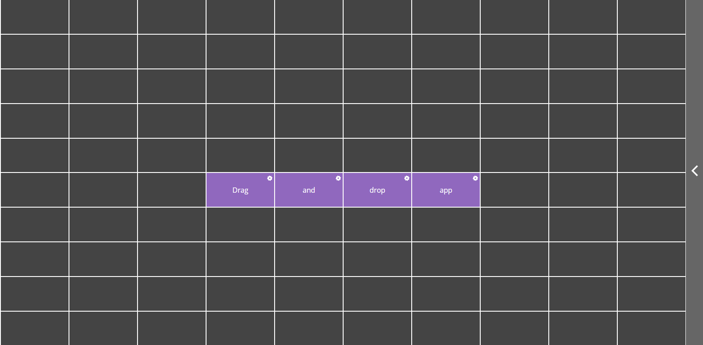

# websocket-draganddrop
Drag and drop board using websockets and firebase.

To test open in to browser windows,  you will see any changes in one updates immediately in the other.
Even if you reload they will still stay in place as movements are recorded in a firebase database.

Live: https://draganddropapp.herokuapp.com/

